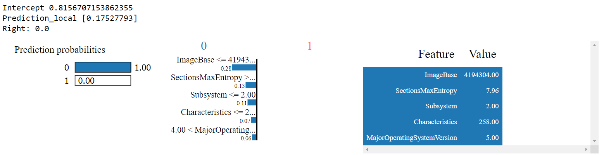
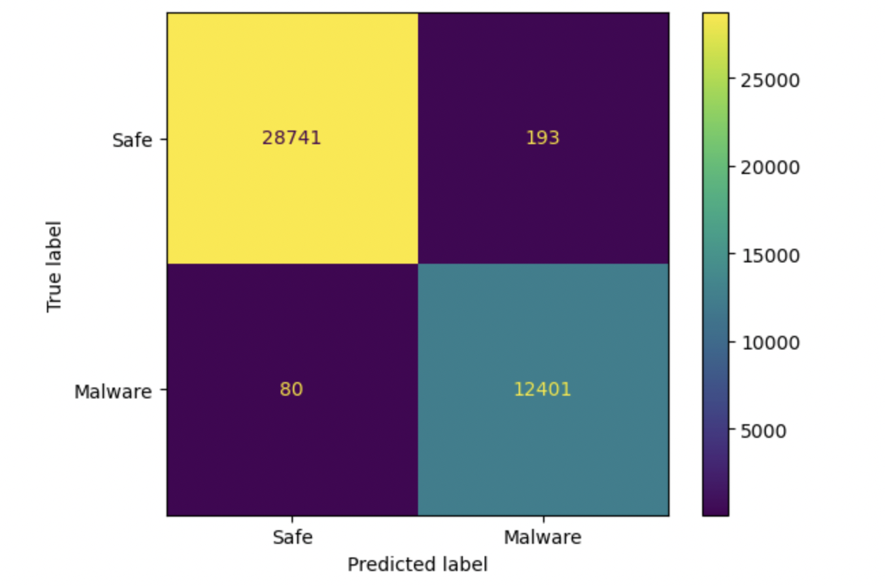

# Ransomware Detection using Machine Learning


**Goal of this Project**\
Predict Ransomware based on file properties extracted from a tool. This model is a part of Full Antivirus + Malware Protection Software.
Its a classification problem (Supervised Machine Learning). The data was immbalanced and needed to be transformed (Synthetic Samples: SMOTE-Tomek).


**Highlights**
* ***LazyPredict*** for AutoML  [Official Documentation](https://lazypredict.readthedocs.io/en/latest/readme.html#classification)
* LIME for Local Explainations   
* Weight of Evidence (Feature Selection Technique on Feature Separation Power)  [Read More](https://www.listendata.com/2015/03/weight-of-evidence-woe-and-information.html)
* Removing Multi-colinear features (VIF)


|  | 
|:--:| 
| *LIME Explainability for Local Interpretation* |


**Model Performance on Test Dataset**
|  | 
|:--:| 
| *Confusion Matrix* |


**Metrics**
* Model Used: Random Forest
* F1 Score: 0.99
* Matthews Correlation Coefficient (MCC): 0.985
* AUC-ROC: 0.993


**Install Libraries using requirements.txt**
```
pip install -r /path/to/requirements.txt
```