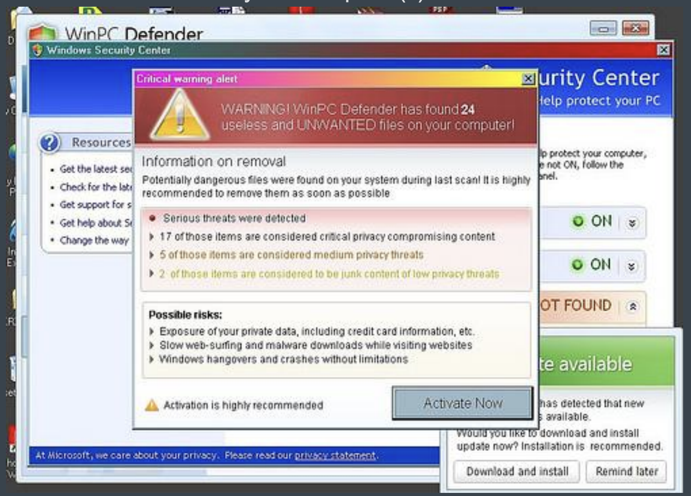

# Ransomware Detection using Machine Learning




**Goal of this Project**\
Predict Ransomware & Malware based on file properties extracted from a tool. It's a classification problem (Supervised Machine Learning). The data was imbalanced and must be transformed using (Synthetic Samples: SMOTE-Tomek).


**Highlights**
* ***LazyPredict*** for AutoML  [Official Documentation](https://lazypredict.readthedocs.io/en/latest/readme.html#classification)
* LIME for Local Explainations   
* Weight of Evidence (Feature Selection Technique on Feature Separation Power)  [Read More](https://www.listendata.com/2015/03/weight-of-evidence-woe-and-information.html)
  

|  | 
|:--:| 
| *LIME Explainability for Local Interpretation* |


**Model Performance on Test Dataset**
|  | 
|:--:| 
| *Confusion Matrix* |


**Metrics**
Test Data Results:
* Model Used: Random Forest
* Accuracy: 0.9933
* Precision: 0.9847
* Recall: 0.9931
* F1 Score: 0.9889
* MCC: 0.9841
* False Positive Rate: 0.0067
* AUC Score: 0.9994


**Install Libraries using requirements.txt**
```
pip install -r /path/to/requirements.txt
```
